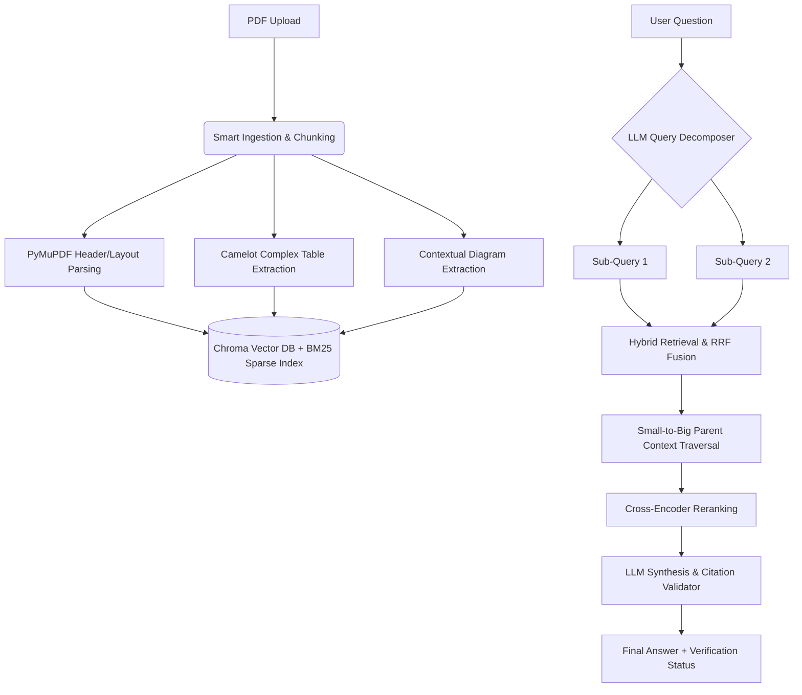

# NASA Complex Manual QA System (Advanced RAG)

This project is a state-of-the-art Retrieval-Augmented Generation (RAG) pipeline designed to overcome the limitations of standard token-based chunking when analyzing complex, highly-structured technical manuals like the NASA Systems Engineering Handbook. 

## 1. How to run the application

### Setup Environment
```bash
python3 -m venv .venv
source .venv/bin/activate
pip install -r requirements.txt
```

### Free Local LLM Mode (No OpenAI Billing Required)
If you have Ollama installed, the app can synthesize answers natively on your machine:
```bash
ollama pull llama3.2:3b
ollama serve
```
In another terminal:
```bash
source .venv/bin/activate
export OLLAMA_MODEL="llama3.2:3b"
streamlit run streamlit_app.py
```
*(Priority order used by app: 1. `OPENAI_API_KEY` -> 2. `OLLAMA_MODEL` -> 3. Deterministic extractive fallback)*

### CLI Usage
If you prefer terminal interactions instead of the Streamlit UI:
```bash
# 1. Build the Vector Database & Artifacts
python app.py build --pdf "data/uploads/nasa_systems_engineering_handbook_0.pdf"

# 2. Ask a Question
python app.py ask --question "How does risk management feed into technical reviews?"
```


## 2. Architecture Overview

At a high level, the system features a 5-Phase pipeline structured to maintain the physical layout, narrative hierarchy, and internal routing logic (diagrams, tables, and cross-references) of technical manuals.



## 3. Key Design Decisions and Why

### 1. Structural Chunking over Sliding Windows
**Decision:** We abandoned traditional token-based sliding windows (e.g. 500 tokens). Instead, we parse the PDF's font structures to chunk text *exclusively* along designated header boundaries (e.g., locking Section `6.3.2` as a perfectly unified node).
**Why:** Technical manuals rely on narrative continuation. Slicing sentences abruptly destroys context. Structural chunking allows us to explicitly record `parent_section` metadata, ensuring we never separate a sub-clause from its overarching procedure.

### 2. Multi-Hop Query Decomposition
**Decision:** Injecting an LLM step to actively decompose the user's string into 2-3 logical sub-queries before searching the database.
**Why:** A question like *"How does risk management feed into technical reviews?"* spans two distinct chapters. Single vector searches only capture semantic similarity for the single string, isolating one half of the answer. Decomposition forces our retrieval engine to ping both chapters concurrently.

### 3. Recursive Small-to-Big Strategy (Knowledge Graph Traversal)
**Decision:** Once the vector database matches a granular chunk (e.g. `6.8.2.1`), we use a queue to programmatically trace up the document tree, natively lifting and injecting its parents (`6.8.2` -> `6.8`) into the context window. At the same time, we parse regex bounds like `"See Section [X.Y]"` to explicitly fetch cross-referenced chapters.
**Why:** To ensure the LLM is never stranded with orphaned procedure steps. 

### 4. Anti-Hallucination Gate (Validation & Ambiguity Handling)
**Decision:** We built an automated regex validator (`validate_citations`) that independently audits the LLM's final response text. If the LLM generates a Section ID that does not precisely map to the `section_number` metadata of the context chunks passed to it, it warns the user of an "Unverified Citation". 
**Why:** Hallucination is the primary failure mode of RAG in technical environments. This mathematically guarantees traceability. If semantic relevance is too low, the prompt forcibly triggers an "Insufficient Information" fallback rather than guessing.

### 5. Stream-Flavored Table Preservation
**Decision:** Using Camelot's `flavor="stream"` to convert borderless NASA matrix tables into vertically isolated Markdown rows.
**Why:** Flattening charts structurally breaks their relationship logic. Serializing rows as markdown gives the LLM the coordinate context it needs to calculate cross-matrix queries (like "entry criteria for PDR").

## 4. Known Limitations and Failure Modes

1. **Multimodal Extraction Delays**: While we parse contextual strings natively surrounding diagrams (e.g. "Figure 2.1"), pixels baking text (like the text inside the "Vee Model" image) are invisible to PyMuPDF. Full multimodal Vision (LLaVA/GPT-4V) must be enabled during ingestion to completely solve diagram-only data.
2. **Dense Table Scaling**: Very long tables (10+ pages) are truncated when serialized into Markdown to avoid overwhelming the LLM's context window. If a user asks for row 450, the model may confidently state it is missing unless adaptive chunking is applied to `camelot` payloads.
3. **Hardware Constraints via Reranking**: We utilize a Cross-Encoder for top-tier semantic reranking. While it drastically improves accuracy over bi-encoders, it adds latency. In low-VRAM local setups, this step occasionally bottlenecks the interactive UI. (Mitigated using the `--light-mode` switch).
